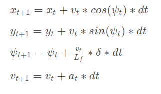

# Self-Driving Car Nanodegree Program - Term 2
## Project 5 - MPC Control
**Ricardo Picatoste**

## Notes
The project has been compiled in Windows 10 using the "Bash on Ubuntu on Windows", generating the make file with "cmake CMakeLists.txt" and then running make. 

To set up all the libraries, I followed this forum post, with some additional steps since I was not working in Linux:
[Installing dependencies](https://discussions.udacity.com/t/how-to-install-project-dependencies-and-quizzes-for-ubuntu/304975)

I have used a tab width of 4 spaces, taking care of the matrices alignment. I hope it's ok, I prefer it like that for programming.

## Results

The car does the whole track without leaving the road. The speed is set to 40, and the controller does an excellent job keeping the car between the lanes, at the selected speed.

### About the model

The model used to implement the model predictive controller of the car is a state space model, with:

- State vector containing: position (x and y axis), speed and car axis angle (psi). This vector is augmented with the crosstrack error and the orientation error, with the purpose to minimize them with the model predictive control algorithm. 
- Input vector containing: acceleration (a) and steering angle (delta). 

The basic equations are those of a dynamic model, with inputs being the acceleration and the steering angle:

To implement this I used the reference frame of the car, and therefore a translation plus rotation must be applied to these coordinates. This transformation is indeed applied to the reference path to be followed by the car before feeding it to the solver.

To implement this, first the translation to the center of the car is applied to each point of the path:

	double dx = ptsx[ii] - px;
	double dy = ptsy[ii] - py;

Then the rotation by the car orientation psi. The result is stored in the vectors storing the reference path.

	reference_path_x.push_bac(dx * cos(-psi) - dy * sin(-psi));
	reference_path_y.push_back(dx * sin(-psi) + dy * cos(-psi));

Once this transformation is done, and before passing the current state to the solver, the next state is predicted applying the state space equations shown above, using the a time step equal to the given latency of the actuator inputs (normally known as pure delay). 

To chose N and dt I just followed a thumb rule for discrete controllers applied to autonomous cars, where 10 Hz is a proper rate for the dynamics of the car. N I kept it to 10, so a second of trajectory is used for the calculations. I tried a couple more values (faster and slower sampling rate), without noticing big changes, and stayed with my initial choice.

### Challenges
The hardest parts were 2: 

- To solve the problem of the latency. I had to look through the forums, and after trying the prediction of the state in different places of the code without success it finally worked. The initial problem is that I was doing the trajectory transformation of coordinates with the predicted state, leading to error.

- The next hard point was to select the order of the polynomial to fit to the desired trajectory. I tried 5 and the result was good except for after more that half circuit, the controller got apparently crazy. With an order of 3 this problem is avoided. Probably with a more careful fit of the polynomial the higher order could be used.

The last point was the tuning. At the beginning both control actions where oscillatory, with the car going around the desired trajectory, and accelerating and applying brakes in alternation. With 100 as coefficient for both control actions the result is much better, avoiding both oscillations.

